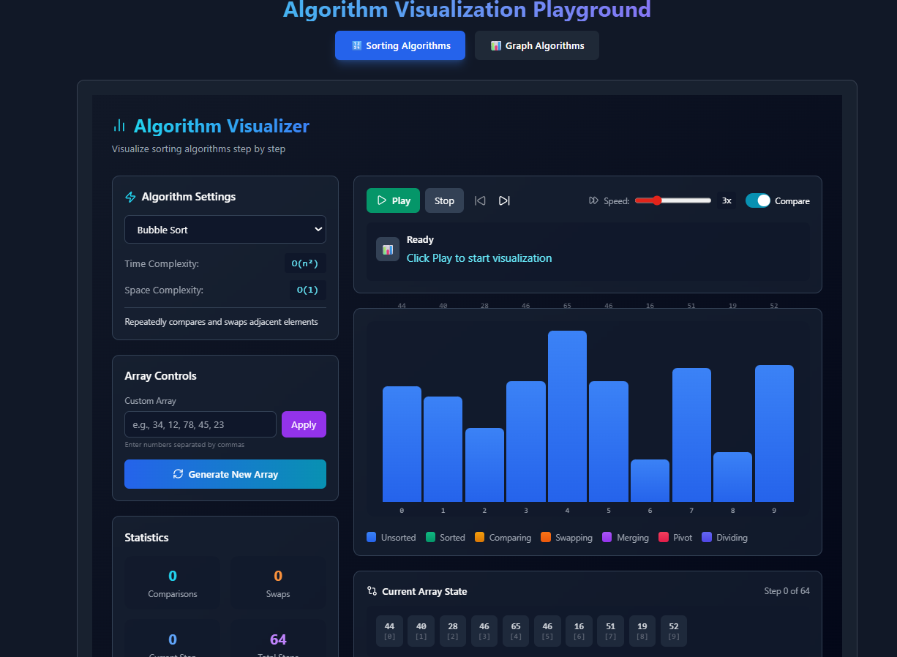
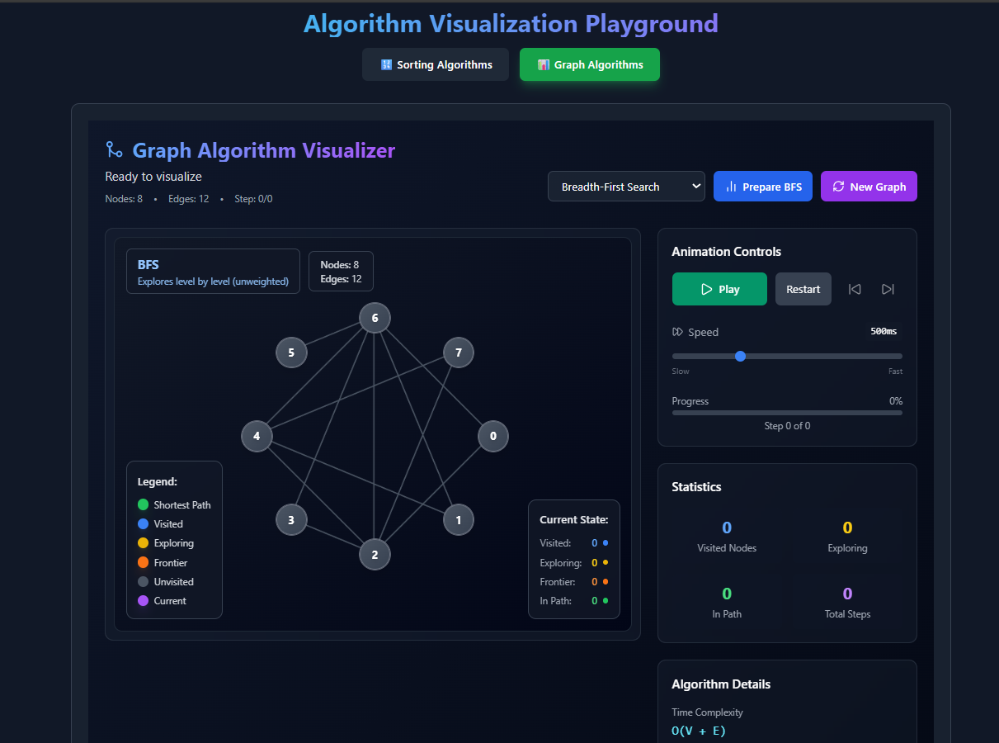

# 🚀 Algorithm Visualizer

A comprehensive, interactive web application for visualizing sorting and graph algorithms with real-time animations and step-by-step explanations.


## ✨ Live Demo

🔗 **[Try it live here!]({https://algorithm-visualizer-three-eta.vercel.app/})** 



## 📱 Features

### 🎯 **Sorting Algorithms**
- **Bubble Sort** - O(n²) time complexity
- **Selection Sort** - O(n²) time complexity  
- **Insertion Sort** - O(n²) time complexity
- **Merge Sort** - O(n log n) time complexity
- **Quick Sort** - O(n log n) time complexity
- **Heap Sort** - O(n log n) time complexity

### 🌐 **Graph Algorithms**
- **BFS** (Breadth-First Search) - Level-by-level traversal
- **DFS** (Depth-First Search) - Deep path exploration
- **Dijkstra's Algorithm** - Shortest path with weights
- **Bellman-Ford** - Shortest path with negative weights
- **Topological Sort** - Linear ordering of DAG
- **Prim's Algorithm** - Minimum Spanning Tree
- **Kruskal's Algorithm** - MST using Union-Find
- **Floyd-Warshall** - All-pairs shortest paths
- **A* Search** - Heuristic pathfinding
- **TSP** (Traveling Salesman) - NP-hard optimization

## 🎨 Key Features

### 🔄 **Real-time Visualization**
- Step-by-step algorithm execution
- Color-coded element states
- Interactive play/pause controls
- Adjustable animation speed

### 📊 **Comprehensive Statistics**
- Step counter and progress tracking
- Comparison and swap counts
- Time and space complexity display
- Algorithm-specific metrics

### 🎮 **Interactive Controls**
- Play/Pause/Step forward/backward
- Speed control (0.5x to 8x)
- Custom array input
- Random graph generation
- Algorithm selection

### 📱 **Responsive Design**
- Works on desktop, tablet, and mobile
- Adaptive layouts for different screen sizes
- Touch-friendly interface
- High DPI support

## 🛠️ Tech Stack

**Frontend:**
- ⚛️ **React 18** - Component-based architecture
- 🎨 **Tailwind CSS** - Utility-first styling
- 🚀 **Vite** - Fast build tool and dev server
- 📱 **Responsive Design** - Mobile-first approach

**Visualization:**
- 🎯 **HTML5 Canvas** - Graph rendering
- 🎨 **CSS Animations** - Smooth transitions
- 🔄 **React Hooks** - State management
- 📊 **Real-time Updates** - Live algorithm visualization

## 🚀 Getting Started

### Prerequisites
- Node.js 16+ and npm/yarn

### Installation

1. **Clone the repository**
```bash
git clone https://github.com/yourusername/algorithm-visualizer.git
cd algorithm-visualizer
```

2. **Install dependencies**
```bash
npm install
# or
yarn install
```

3. **Start the development server**
```bash
npm run dev
# or
yarn dev
```

4. **Open in browser**
```
http://localhost:5173
```

### Build for Production
```bash
npm run build
# or
yarn build
```

## 📁 Project Structure

```
algorithm-visualizer/
├── src/
│   ├── components/
│   │   ├── SortingVisualizer/
│   │   │   ├── index.jsx           # Main sorting component
│   │   │   ├── AlgorithmPanel.jsx  # Algorithm selection
│   │   │   ├── ArrayControls.jsx   # Array configuration
│   │   │   ├── StatsPanel.jsx      # Statistics display
│   │   │   ├── VisualizationArea.jsx # Bar visualization
│   │   │   └── ControlBar.jsx      # Playback controls
│   │   ├── GraphVisualizer/
│   │   │   ├── index.jsx           # Main graph component
│   │   │   ├── GraphCanvas.jsx     # Graph rendering
│   │   │   ├── GraphNode.jsx       # Node component
│   │   │   └── GraphControls.jsx   # Graph controls
│   │   └── common/
│   │       ├── BarGraph.jsx        # Reusable bar component
│   │       ├── StepDescription.jsx # Step info display
│   │       └── Legend.jsx          # Color legend
│   ├── algorithms/
│   │   ├── sorting/
│   │   │   ├── bubbleSort.js
│   │   │   ├── selectionSort.js
│   │   │   ├── insertionSort.js
│   │   │   ├── mergeSort.js
│   │   │   ├── quickSort.js
│   │   │   └── heapSort.js
│   │   ├── graph/
│   │   │   ├── bfs.js
│   │   │   ├── dfs.js
│   │   │   ├── dijkstra.js
│   │   │   ├── bellmanFord.js
│   │   │   ├── topologicalSort.js
│   │   │   ├── prim.js
│   │   │   ├── kruskal.js
│   │   │   ├── tsp.js
│   │   │   ├── floydWarshall.js
│   │   │   └── aStar.js
│   │   └── index.js               # Algorithm exports
│   ├── utils/
│   │   ├── algorithmFactory.js    # Algorithm management
│   │   ├── graphGenerator.js      # Random graph generation
│   │   └── helpers.js             # Utility functions
│   └── App.jsx                    # Main application
├── public/                        # Static assets
├── index.html                     # HTML template
├── package.json                   # Dependencies
├── vite.config.js                 # Vite configuration
├── tailwind.config.js             # Tailwind config
└── README.md                      # This file
```

## 🎯 How It Works

### Sorting Visualizer
1. **Select Algorithm** - Choose from 6 sorting algorithms
2. **Configure Array** - Set size or input custom values
3. **Visualize** - Watch the algorithm sort step by step
4. **Analyze** - View statistics and comparisons

### Graph Visualizer
1. **Select Algorithm** - Choose from 10+ graph algorithms
2. **Generate Graph** - Create random or custom graphs
3. **Visualize** - Watch algorithm traverse nodes
4. **Track Progress** - Monitor queue, stack, and distances

## 🎨 UI/UX Features

### Color Coding
- 🔵 **Blue** - Unsorted/Unvisited nodes
- 🟢 **Green** - Sorted/Path nodes
- 🟡 **Yellow** - Comparing/Exploring nodes
- 🟠 **Orange** - Swapping/Frontier nodes
- 🔴 **Red** - Active nodes
- 🟣 **Purple** - Current node

### Interactive Elements
- 🎮 **Playback Controls** - Full control over animation
- 📊 **Real-time Stats** - Live algorithm metrics
- 🔍 **Step Details** - Current operation explanation
- 📱 **Responsive Layout** - Adapts to any screen size

## 📚 Learning Resources

### For Students
- **Algorithm Complexity** - Real-time O() notation display
- **Step-by-step Execution** - Understand each algorithm operation
- **Visual Comparisons** - See different algorithm approaches
- **Interactive Learning** - Hands-on algorithm exploration

### For Developers
- **Clean Architecture** - Modular, maintainable codebase
- **Performance Optimized** - Efficient rendering and updates
- **Extensible Design** - Easy to add new algorithms
- **Production Ready** - Error handling and fallbacks

## 🚧 Future Enhancements

### Planned Features
- [ ] **More Algorithms** - Add more sorting and graph algorithms
- [ ] **Compare Algorithms** - Side-by-side comparison view
- [ ] **Export Results** - Save visualizations as images/videos
- [ ] **User Accounts** - Save favorite configurations
- [ ] **Mobile App** - Native iOS/Android applications
- [ ] **API Integration** - Algorithm execution backend
- [ ] **Educational Mode** - Guided tutorials and challenges
- [ ] **Dark/Light Mode** - Theme switching
- [ ] **Internationalization** - Multi-language support

### Technical Improvements
- [ ] **Web Workers** - Offload heavy computations
- [ ] **WebGL** - 3D graph visualizations
- [ ] **PWA Support** - Install as desktop/mobile app
- [ ] **Accessibility** - Full WCAG compliance
- [ ] **Performance** - Optimize large dataset handling

## 🤝 Contributing

We welcome contributions! Here's how you can help:

1. **Fork the repository**
2. **Create a feature branch**
```bash
git checkout -b feature/amazing-feature
```
3. **Commit your changes**
```bash
git commit -m 'Add amazing feature'
```
4. **Push to the branch**
```bash
git push origin feature/amazing-feature
```
5. **Open a Pull Request**

### Contribution Areas
- 🎨 **UI/UX Improvements** - Better designs and interactions
- 🚀 **New Algorithms** - Implement additional algorithms
- 🐛 **Bug Fixes** - Fix issues and improve stability
- 📚 **Documentation** - Improve guides and tutorials
- 🌐 **Internationalization** - Add translations
- 🧪 **Testing** - Add unit and integration tests

## 📄 License

This project is licensed under the MIT License - see the [LICENSE](LICENSE) file for details.

## 🙏 Acknowledgments

- **React Team** - For the amazing framework
- **Tailwind CSS** - For the utility-first CSS framework
- **Vite** - For the fast build tool
- **Algorithm Authors** - For the fundamental algorithms
- **Open Source Community** - For inspiration and support

## 📞 Support

Need help? Here are your options:

1. **Open an Issue** - For bug reports and feature requests
2. **Discussion Forum** - For questions and discussions *(if applicable)*
3. **Email Support** - contact@example.com *(if applicable)*
4. **Documentation** - Check the [wiki](https://github.com/yourusername/algorithm-visualizer/wiki) *(if applicable)*


---

Made with ❤️ by [Your Name]

If you find this project useful, please give it a ⭐ on GitHub!

## 📊 Project Stats


---

<div align="center">

### **Happy Coding! 👨‍💻👩‍💻**

*Visualize, Learn, Master Algorithms*

[🚀 Try Now](#) | [📖 Documentation](#) | [🐛 Report Issue](#) | [💡 Suggest Feature](#)

</div>

